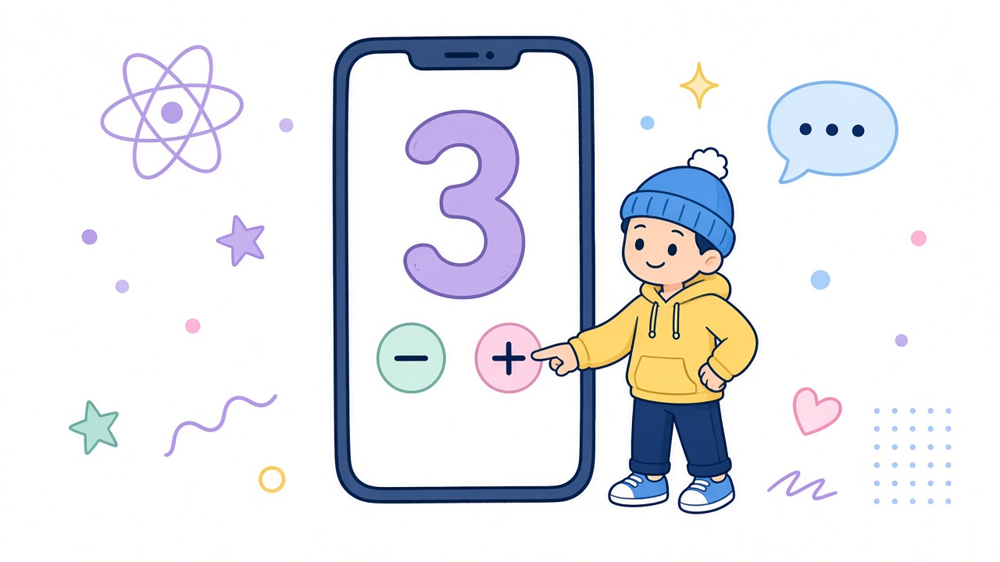

# Пара 3 · Лаба useState — счётчик на вкладке

<div align="center">



**Живая лаба:** экран-счётчик на `useState` внутри Bottom Tabs.

</div>

---

## Зачем (коротко)

На паре 2 вы уже видели идею `useState`.  
Сейчас **делаем руками**: отдельный экран, три кнопки, вкладка в Tabs.

Теория-шпаргалка: [`para2/use-state`](../../para2/use-state/use-state.md) — сюда не копируем лекцию, только практика.

---

## Напоминание за 30 секунд

```tsx
import { useState } from 'react';

const [count, setCount] = useState(0);
//      ^       ^              ^
//   значение  сеттер       старт
```

- Читать: `count`
- Менять: только `setCount(...)`
- После сеттера экран **перерисуется**

---

## Полный пример: CounterScreen

Правила лабы: старт **0**, **−** не ниже 0, **Reset** → 0.

```tsx
import { useState } from 'react';
import { View, Text, Pressable, StyleSheet } from 'react-native';

export default function CounterScreen() {
  const [count, setCount] = useState(0);

  return (
    <View style={styles.container}>
      <Text style={styles.title}>Счётчик</Text>
      <Text style={styles.value}>{count}</Text>

      <View style={styles.row}>
        <Pressable
          style={styles.btn}
          onPress={() => setCount((c) => Math.max(0, c - 1))}
        >
          <Text style={styles.btnText}>−</Text>
        </Pressable>

        <Pressable style={styles.btn} onPress={() => setCount(0)}>
          <Text style={styles.btnText}>Reset</Text>
        </Pressable>

        <Pressable
          style={styles.btn}
          onPress={() => setCount((c) => c + 1)}
        >
          <Text style={styles.btnText}>+</Text>
        </Pressable>
      </View>
    </View>
  );
}

const styles = StyleSheet.create({
  container: {
    flex: 1,
    justifyContent: 'center',
    alignItems: 'center',
    backgroundColor: '#fff',
    padding: 16,
  },
  title: { fontSize: 20, marginBottom: 8, color: '#666' },
  value: { fontSize: 64, fontWeight: '700', marginBottom: 24 },
  row: { flexDirection: 'row', gap: 12 },
  btn: {
    backgroundColor: '#111',
    paddingHorizontal: 18,
    paddingVertical: 12,
    borderRadius: 12,
  },
  btnText: { color: '#fff', fontSize: 18, fontWeight: '600' },
});
```

Файл: `screens/CounterScreen.tsx` (или `app/(tabs)/counter.tsx` — как у вас устроены табы).

---

## Куда воткнуть в Tabs

```tsx
import CounterScreen from '../screens/CounterScreen';

// ...
<Tab.Screen name="Counter" component={CounterScreen} />
// или name="Labs" — как договорились в ДЗ пары 2
```

Заглушку «Скоро: useState» / пустой экран — **заменить** на живой `CounterScreen`.

---

## Спека (SDD)

Создайте (или допишите) файл в проекте студента:

`SPECS/lab-usestate.md`

```text
Цель: экран-счётчик на useState.

Стек: Expo + TypeScript.
Экран CounterScreen на отдельной вкладке (Labs / Counter).
UI: число по центру; кнопки +, −, Reset.
Поведение: старт 0; − не ниже 0; Reset → 0.
Ограничения: только useState + StyleSheet; без библиотек.
Готово, если: три кнопки работают, экран в Tabs, код объясним.
Не делаем: AsyncStorage, сервер, анимации, Redux/Zustand.
```

---

## Acceptance checklist

- [ ] Есть `SPECS/lab-usestate.md` по шаблону выше
- [ ] Файл экрана (не только правка внутри `App.tsx`)
- [ ] `useState(0)` и три кнопки
- [ ] `+` увеличивает, `−` не уходит ниже 0, `Reset` → 0
- [ ] Экран открывается из Bottom Tabs
- [ ] Можете вслух объяснить: что такое `count` и `setCount`

---

## Частые ошибки

| Ошибка | Почему плохо |
|---|---|
| `count++` / `count = 5` | UI не обновится правильно |
| `useState` внутри `if` / цикла | Нарушение правил хуков |
| Забыли `import { useState } from 'react'` | Красный экран |
| Весь код только в `App.tsx` | Потом не разнести по лабам / табам |
| `−` уходит в отрицательные | Не по спеке |

---

## Tips на живой паре

1. **Пара с соседом:** один пишет, второй читает спеку вслух и кликает по чеклисту.
2. Не оставляйте решение только в `App.tsx` — сразу отдельный экран + вкладка.
3. Сначала заставьте `+` работать, потом `−` с `Math.max`, потом Reset.
4. Если Expo Go «молчит» — смотрите Metro / красный экран, не переписывайте всё подряд.

---

## ИИ-промпт (опционально)

```text
Expo + TypeScript + React Navigation Bottom Tabs.
Сделай CounterScreen строго по спеке SPECS/lab-usestate.md.
Только useState и StyleSheet. Отдельный файл экрана, подключи к Tab.Screen.
Не добавляй AsyncStorage, API, анимации.
```

---

## Ссылки

- Теория: [`para2/use-state`](../../para2/use-state/use-state.md)
- [useState (react.dev)](https://react.dev/reference/react/useState)
